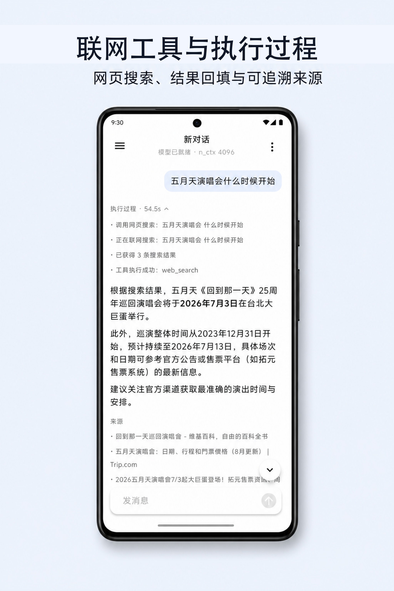
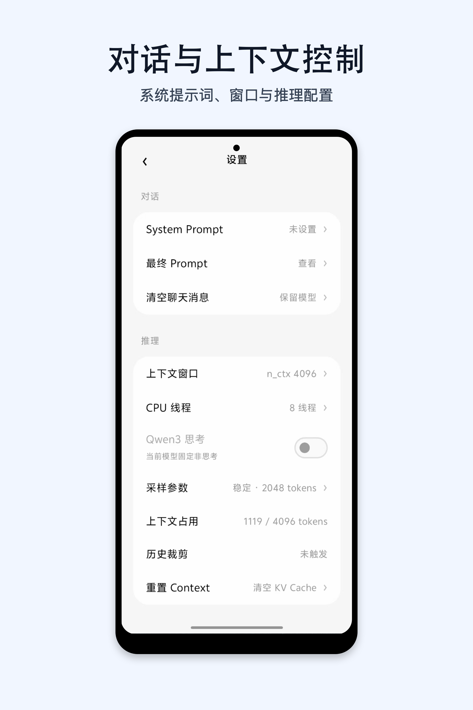
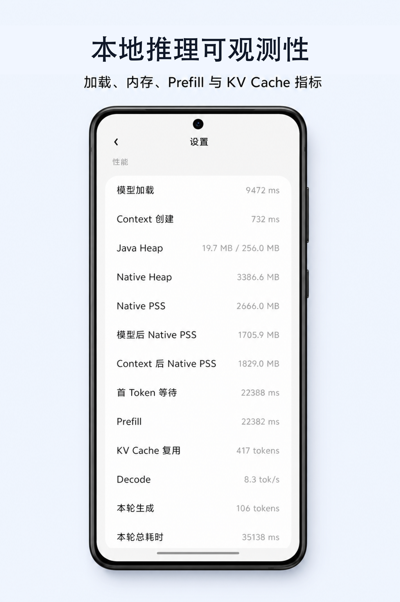
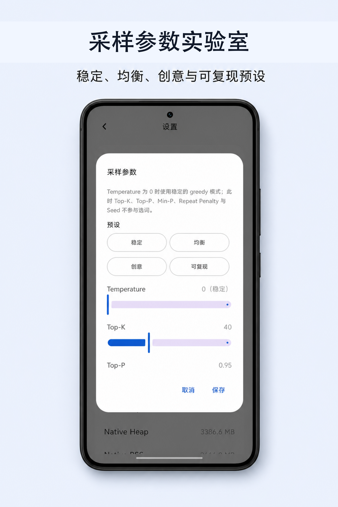
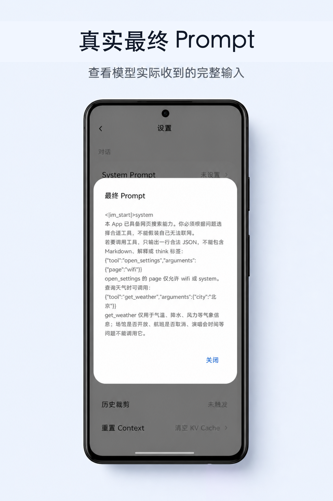

# Android Local LLM Lab

<p align="center">
  面向 Android 的本地大模型推理与 Agent 实验室
</p>

<p align="center">
  <strong>GGUF · llama.cpp · JNI · Kotlin / Compose · KV Cache · Function Calling</strong>
</p>

Android Local LLM Lab 是一个学习型 Android 项目：在手机上导入 GGUF 模型，使用 llama.cpp 完成本地流式对话，并把一次回答从 Compose、Kotlin、JNI 一直追踪到 C++ / llama.cpp 的推理现场。

它不只是一个聊天界面，更关注本地 LLM 的可观测性与可控性：真实 Prompt、Token、Context、KV Cache 复用、内存快照、采样参数，以及受控的天气、网页搜索和系统设置工具调用。

> 默认情况下推理在设备本地完成。只有模型实际调用 `get_weather` 或 `web_search` 时，才会访问对应的公开网络服务。

## 应用预览

<p align="center">
  
  
  
</p>

<p align="center">
  
  
</p>

## ✨ 核心能力

- **本地 GGUF 对话**：从系统文件选择器导入 GGUF，模型与 Context 由 Native Runtime 管理，逐 Token 流式输出。
- **真实 Chat Template**：不把任一模型格式写死在 App 中，直接读取 GGUF 的 `tokenizer.chat_template` 组织最终 Prompt。
- **思考模式与 Markdown**：支持模型 `<think>` 内容与正文分离展示；正文支持基础 Markdown 渲染。
- **多轮上下文与 KV Cache**：Kotlin 消息记录是事实来源；Native Context 作为可重建缓存。根据 Prompt Token 公共前缀增量复用 KV Cache，前缀变化时安全回退为完整 Prefill。
- **上下文预算**：通过当前模型 Tokenizer 统计 Prompt Token；历史消息按完整轮次裁剪，并为 Decode 预留输出空间。
- **推理参数实验室**：提供稳定、均衡、创意、可复现四档预设，并可调整 Temperature、Top-K、Top-P、Min-P、Repeat Penalty、Seed 与最大输出 Token。
- **性能与内存观测**：展示模型加载、Context 创建、首 Token、Prefill、Decode、总耗时、KV Cache 复用 Token，以及 Java Heap / Native Heap / PSS 快照。
- **受控 Function Calling**：模型仅能输出结构化请求；Kotlin 白名单校验后执行工具，并把结果回填模型。当前内置：
  - `open_settings(page)`：打开 Wi-Fi 或系统设置；
  - `get_weather(city)`：通过 Open-Meteo 查询天气；
  - `web_search(query)`：通过 Tavily 搜索网页，展示可折叠执行过程与可点击来源。
- **生成过程体验**：生成时自动跟随到底部；用户向上浏览历史后停止自动滚动，并提供回到底部按钮。

## 推理链路

```text
Compose UI
  ↓
ChatViewModel（消息、上下文预算、工具循环）
  ↓
LocalLlmRuntime
  ↓
NativeLlmBridge（JNI）
  ↓
bridge.cpp
  ↓
llama.cpp
  ↓
GGUF 模型
```

工具调用路径：

```text
本地模型输出 Tool JSON
  ↓
Kotlin 解析与白名单校验
  ↓
执行 Android Intent / HTTPS 请求
  ↓
记录“执行过程”，压缩结果后回填模型
  ↓
本地模型生成最终回答与来源展示
```

## 🏁 快速开始

### 1. 克隆仓库与子模块

```bash
git clone --recurse-submodules https://github.com/Arick-a/androidLocalLlmLab.git
cd androidLocalLlmLab
```

如果已经克隆过仓库：

```bash
git submodule update --init --recursive
```

### 2. 构建并安装

使用 Android Studio 打开项目，或执行：

```bash
./gradlew :app:assembleDebug
```

当前 Native 构建目标为 `arm64-v8a`，请使用 ARM64 Android 真机测试。首次构建需要安装 Android NDK `26.3.11579264` 与 CMake `3.22.1`。

### 3. 导入模型

启动 App 后，从文件选择器导入一个聊天模型 GGUF 文件。模型文件会复制到 App 私有目录，之后可自动恢复上次选择。

建议从较小量化模型开始，以便先观察加载、Context 与生成性能；模型大小、量化等级、`n_ctx` 与设备内存都会直接影响体验。

### 4. 可选：启用网页搜索

网页搜索使用 Tavily。将你自己的 Key 仅写入本机根目录 `local.properties`：

```properties
tavily.api.key=你的_Tavily_Key
```

`local.properties` 已被 Git 忽略。该方案会把 Key 编入 Debug APK，**仅适用于个人开发测试，不能分发包含 Key 的 APK**。正式发布时应将搜索调用放到自己的后端。

## 📊 如何观察一次推理

1. 在设置中选择 `n_ctx`、CPU 线程数和采样预设。
2. 发送问题，在设置页查看最终 Prompt、真实 Prompt Token 数与历史裁剪情况。
3. 观察首 Token、Prefill、Decode、总耗时和 KV Cache 复用 Token。
4. 查询实时信息时，展开聊天中的“执行过程”，确认实际工具调用、查询步骤与来源。
5. 分别尝试“清空聊天消息”“重置 Context”“卸载模型”，理解 Kotlin 历史、Native KV Cache 与模型权重的生命周期边界。

## 🔐 数据与权限边界

- 用户聊天记录保存在当前 ViewModel 内，是重建 Prompt 的事实来源。
- 模型推理、Token 统计、Prefill 和 Decode 在本地 llama.cpp Runtime 中执行。
- `Context` / KV Cache 是 Native 推理缓存，不是持久化聊天记录；可随时重建或清空。
- 工具不能任意执行：模型只提出请求，Kotlin 负责工具名、参数、Intent 与网络调用的白名单校验。
- 天气和网页搜索是可选联网能力，调用时会将城市或查询词发送给对应服务。

## 🛠️ 技术栈

- Kotlin + Jetpack Compose
- Android ViewModel + StateFlow
- JNI + C++17
- [llama.cpp](https://github.com/ggml-org/llama.cpp)（Git Submodule）
- GGUF / `tokenizer.chat_template`
- Open-Meteo（天气）与 Tavily（可选网页搜索）

## 学习重点

这个项目刻意保留推理链路与资源边界，而不是把它们隐藏在一个 SDK 后面。适合用来学习：

- Android 本地 LLM 的模型、Context 与线程生命周期；
- Chat Template、Token 统计和上下文窗口预算；
- 增量 KV Cache 的正确复用条件；
- 流式 UI、停止生成和 Native 协作取消；
- Function Calling 的模型决策、Kotlin 权限边界和结果回填循环；
- 本地推理性能、Java / Native 内存与稳定性实验。

## 致谢

- [llama.cpp](https://github.com/ggml-org/llama.cpp)
- [Open-Meteo](https://open-meteo.com/)
- [Tavily](https://tavily.com/)
- README 的信息组织参考 [Google AI Edge Gallery](https://github.com/google-ai-edge/gallery)
